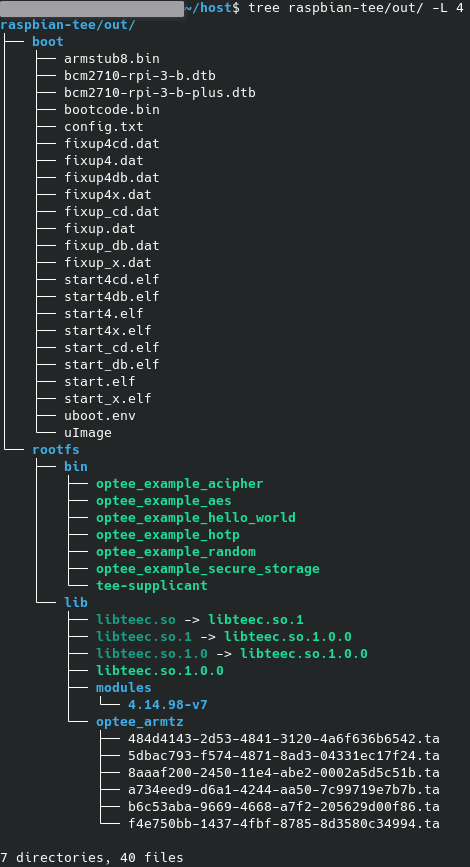

# Run OP-TEE Alongside 2023 Raspbian on a Modern RPi3B+ Revision (Tested with Rev1.4)
The upstream repositor(ies) are rather out of date, and targets a 2018 version of Raspbian, and does not boot at all on modern revisions of the RPi3B+ board due to outdated firmware. This fork attempts to solve these problems.

## Prerequisites
RPi3B(+) board. Tested with RPi3B+ Rev1.4, but other revisions should work too.

A Raspbian image. Tested with https://downloads.raspberrypi.com/raspbian/images/raspbian-2018-03-14/ and https://downloads.raspberrypi.com/raspios_armhf/images/raspios_armhf-2023-05-03/

I'm assuming you have an OP-TEE build environment already. If not, see their documentation on that. I used Ubuntu 22.04 as a base.
```$
pip install --user pycryptodome
sudo apt install u-boot-tools
```

## Building
To do first time setup, including downloading prerequisite repositories and preparing the build environment:

```$
./prepare_env.sh
make patch # Applies custom patches to Arm TF and linux kernel. Re-run only if you delete/redownload them.
```

Then run `make` to build everything.

Once it's finished the out folder should look like:



While it's building you can flash your Raspbian image to your SD card. I have tested 2018-03-13, and later 2023-05-03. I have detailed the installation of both below.
## Installing Alongside 2023 Raspbian
Flash the image to your SD card using your preferred method. Power up the board and let it perform first-time setup. When it's done shut it down and place the SD card back in your build machine, then do:
```$
SDCARD_BOOTFS=/path/to/your/sd/card/boot/partition SDCARD_ROOTFS=/path/to/your/sd/card/rootfs/partition make after-first-boot-setup
```
This will copy over everything necessary to your SD card.

## Installing Alongside 2018 Raspbian
Legacy Raspbian requires a couple extra steps. If you use the Raspberry Pi Imager do NOT use OS customisations - they won't work and will prevent your system from booting. Next, after it has been flashed (but before taking the SD card out and powering the board up), run the following command to update the firmware:
```$
SDCARD_BOOTFS=/path/to/your/sd/card/boot/partition make before-first-boot-setup
```
If you want SSH to be enabled you can do `touch ${SDCARD_BOOTFS}/ssh` now as well.
You may now power up the board and let it do first time setup. Afterwards you should then run `make after-first-boot-setup` as mentioned in the modern raspbian section.

## Building OP-TEE Trusted Applications in Rust
To build the rust examples run:
```$
make rust-examples
```
You can also build a particular example by providing the path to the folder, e.g. `make optee-rust/examples/acipher-rs` (note no trailing slash)

To move all the compiled TA's into the out directory (ready to be copied over to your SD card) you can use:
```$
make rust-examples-install
```
Likewise you can install a particular example by appending `-install` onto the end of the path, e.g. `make optee-rust/examples/acipher-rs-install`.
The executables will then be installed onto the SD card the next time you call `make after-first-boot-setup`.

You can also clean the rust TAs with `rust-examples-clean`, or by appending `-clean` onto a particular path (as above). Note this doesn't clean the out/ directory if you've already `-install`ed them.

## Usage
Once the board has booted, enable the TEE daemon by calling
```$
sudo tee-supplicant -d
```
If everything has gone correctly you can now run trusted applications, e.g. `sudo optee_example_hello_world`

The secure world output is sent over the board's UART by default, with a baud of 115200. Provided you have a USB to serial adapter you can listen with, for example, `sudo picocom -b 115200 /dev/ttyUSB0`

## Current limitations
There are a handful of limitations at present, none of which affect my use-case very much. Feel free to submit a pull request if you get them working yourself. 

- Only one CPU core is active. I believe this has something to do with the RPi kernel using spintables to park secondary cores, whereas something in the Arm TF/OP-TEE stack expects PSCI. It should be noted that linaro maintains a RPi kernel with some fixes applied, however I ran into other problems trying to make this patched kernel work.

- Only supports 32-bit Raspbian. It should be possible to target 64-bit Raspbian (e.g. the OP-TEE dev build uses a 64-bit kernel), but that would require modifying Arm TF, u-boot and kernel configurations. My use-case is fine with 32-bit Raspbian, so I didn't put much effort into this.

- Old kernel: The repo currently uses 4.14. I did briefly try to get newer kernels working but encountered various issues like system hangs and hardware timeouts when starting tee-supplicant. Again, 4.14 is sufficient for my use case so I didn't devote much time to this.
